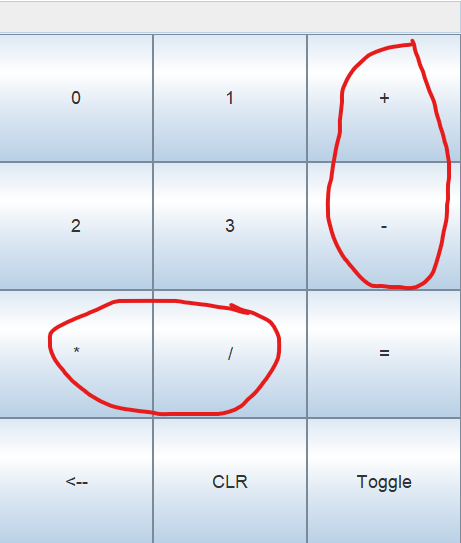

# quaternary-calculator-group-10

A calculator app that allows the user to perform mathematical calculations in the quaternary (base 4) number system.

## Manual

### How to use

1. Enter your first base 4 number using the 0-3 digits
2. Enter your desired operation using one of the operator buttons +, -, *, or /
3. Enter your second base 4 number
4. Click the equals button for the result of your calculation
5. (optional) Press toggle button to toggle your answer between base 4 and base 10
6. Press clear button
7. Repeat steps 1-6 for additional calculations

### Buttons

- "0", "1", "2", and "3" | Digit buttons for inputting your desired base 4 numbers.
- 
- "+", "-", "*", and "/" | Mathematical operation buttons for selecting the type of calculation you want to perform on your base 4 numbers.
- 
- "=" | Performs math operation using your previously input numbers and operator.
- 
- "CLR" | Clears any values currently in the input/output field.
- 
- "Toggle" | Toggles between displaying the answer value in base 4 and base 10.
- 
- "<--" |

## Tasks

[Name] = [Task]
- Connor Counceller = Set up project (GitHub repo, README format, unit testing library, basic empty starting classes, etc.)
- Connor Counceller = Add BaseConverter class, .baseFourToBaseTen() method, and correspondinbg unit tests
- Connor Counceller = Fill out README file and manual/screenshots

## Meetings

9/7/23 9:00am-9:25am | Connor C, Clayton B | In-person meeting | Discussed plans for splitting up remaining work evenly, in a way that works for everyone because of our scheduling issues.
